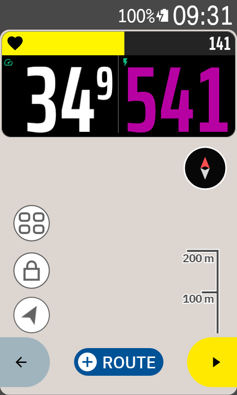

# karoo-bignum

Large, bold numeric data fields for the Hammerhead Karoo, drawn so the number fills the field
instead of floating in the middle of it. 72 fields covering speed, heart rate, power, cadence,
climbing, laps, navigation and time, with optional heart-rate and power zone coloring driven by
your Karoo `UserProfile`.

Numbers are set in **Saira** by default, with equal-width digits so a value does not shift
sideways as its digits change, and an adjustable width and weight — narrower digits make the
number taller, because most fields run out of width before they run out of height. **Oswald
Bold** remains available in the app's settings, and field labels are set in it whichever number
font you pick.

**Climb - Grade** draws the slope as a coloured wedge behind the number, rising for a climb and
falling for a descent, using the same seven colour bands the Karoo's own Climber scale does. The
wedge reaches corner to corner at 20%.

Built on Hammerhead's [karoo-ext](https://github.com/hammerheadnav/karoo-ext) SDK.

## Screenshots

The same page in each of the three zone coloring modes.

| Off | Number | Field background |
|---|---|---|
|  |  |  |

`SPEED`, `GRADE` and `TIME` have no zones, so they stay in the normal text color in every mode.
`GRADE` is showing 22% here to put its wedge at full height; a real road puts it lower.

## Fields

All fields appear in the field picker under **BigNum**.

**Speed** — Speed · Speed - 3s · Speed - 5s · Speed - 10s · Speed - Avg · Speed - Max

**Distance** — Distance

**Heart rate** — HR · HR - Zone · HR - Avg · HR - Max · HR - % of Max · HR - % of HRR · HR - Avg % of HRR

**Cadence** — Cadence · Cadence - 3s · Cadence - 5s · Cadence - 10s · Cadence - Avg · Cadence - Max

**Power** — Power · Power - Zone · Power - 3s · Power - 5s · Power - 10s · Power - 30s ·
Power - 20m · Power - 1hr · Power - Avg · Power - Max · Power - % of FTP · Power - Normalized ·
Power - W/kg · Power - W/kg 3s · Power - W/kg 5s · Power - TSS · Power - Calories

**Climbing** — Climb - Elevation · Climb - Ascent · Climb - Descent · Climb - Grade ·
Climb - VAM · Climb - VAM Avg · Climb - Dist to Top · Climb - Elev to Top

**Lap** — Lap - Number · Lap - Time · Lap - Distance · Lap - Speed · Lap - Max Speed ·
Lap - HR · Lap - Max HR · Lap - Cadence · Lap - Max Cadence · Lap - Avg Power · Lap - Normalized Power ·
Lap - Max Power · Lap - W/kg · Lap - VAM · Lap - Ascent · Lap - Descent

**Navigation** — Nav - To Destination · Nav - To Next Turn · Nav - Time to Destination · Nav - ETA

**Time & environment** — Time - Elapsed · Time - Total · Clock · Sunrise · Sunset ·
Temperature · Battery

**Composite** — HUD - Two Fields

The navigation fields need a route loaded; without one they sit at `--`. **Nav - ETA** is a wall
clock in 24-hour form, drawn whole rather than with raised minutes. **Clock**, **Sunrise** and
**Sunset** are drawn the same way; the Karoo works the two sun times out from where you are, so
they need a position fix before they read anything.

**Time - Elapsed** is the recording clock and stops when the ride does; **Time - Total** runs
from the start of the ride and keeps counting through the stops, so it is the longer of the two
on any ride with a coffee in it.

Speed, distance, elevation and temperature follow the metric/imperial preference from your Karoo
profile. Power-to-weight and TSS use the rider weight and FTP from the same profile.

The Karoo reports plain W/kg itself, but has no smoothed equivalent, so **W/kg 3s** and
**W/kg 5s** are worked out here: smoothed power divided by the rider weight in your profile.
Without a weight to divide by they show `--` rather than a number that would really be watts.

### Durations

Ride time and lap time read `h:mm:ss` from one hour and `m:ss` below it — `4:59`, not `0:04:59`.
The width budget follows the shape of the value, so on the fields where width is the binding
constraint the shorter form is drawn appreciably taller. The clock steps down a size as it
passes the hour; two glyphs of height for the first hour of every ride is the trade.

With **Raised decimals** on, the seconds come out about half size and raised: `1:34:17` reads as
a large **1:34** with a small `17` after it. Hours and minutes are what you read at a glance; the
seconds only need to be present.

### Raised decimals

A setting, on by default, that draws the small end of a value small: a decimal, or a ride time's
seconds. `34.9` becomes 34⁹, `1:34:17` becomes 1:34¹⁷. The point or colon is dropped, because
raised digits already say what they are and the separator's width is width the number can have
instead.

What that width buys depends on the field. Most fields run out of width before they run out of
height, and there the number comes out taller. Where height is the binding constraint — a wide
tile with a short value — the number stays the same size and simply sits in more room.

### Zone coloring

Heart-rate and power fields can carry their zone as a color, using the same colors your Karoo
shows on its Heart Rate Zones and Power Zones settings screens — five zones for heart rate, seven
for power. The boundaries come from your Karoo profile, so a field agrees with the rest of the
device.

Pick one of three modes in the BigNum app (main menu → BigNum):

- **Off** — every value in the normal text color.
- **Number** — the number itself takes the zone color.
- **Field background** — the whole field is filled with the zone color, and the number, label and
  icon switch to black or white, whichever reads better on that fill.

Fields without a zone, a value of zero, and a profile with no zones configured all stay in the
normal text color and are never filled — an empty field should not sit there in a color that
says something about data it does not have.

### HUD

**HUD - Two Fields** is one tile showing two other fields side by side, each drawn as a whole
BigNum field — its own header, zone color, grade wedge and typeface — with a hairline between
them. Pick what each half shows in the BigNum app; any of the other 72 fields will do, the same
one twice included. A half whose sensor drops out recovers on its own without taking the other
half down with it.



An optional **zone bar** runs across the top of the tile. It fills to where your heart rate or
power sits on your Karoo zones and takes that zone's color. Its source is a separate choice, so
`Power - 3s` can drive the bar while the two halves show something else entirely — above, the bar
is heart rate while the halves are speed and 3-second power.

Every zone gets an equal share of the width, so the top of Z3 is three fifths along whatever your
zones are set to. That is deliberate rather than a shortcut: it needs only each zone's own
boundaries, so a scale whose top zone has no sensible ceiling cannot pin the bar near empty for a
whole ride, and the bar reads the same on two riders with different numbers.

The bar carries its source's icon and the live value, the value in the same font as every other
number — it is a reading, not a caption. Both are drawn twice and clipped at the fill's edge, so a
glyph the edge runs through is simply split — black on the zone color, white on the empty track,
legible on either side wherever the fill happens to be. Its height is measured on the digits
rather than set as a text size, so it stays put when you change the face.

With the bar up the two halves drop their labels and keep only their icon, since the bar has
taken the row the labels were read from. The bar is laid over the tile rather than stacked above
it, so neither number gives up height unless it would otherwise end up underneath it.

Turning zone coloring off turns the bar off too, on the same reading the grade wedge follows: a
rider who wants no color means everywhere. Without zones in your Karoo profile there is nothing
for the bar to fill towards, so it stays hidden rather than showing a track that never moves.

## Installation

### Karoo 3 (Companion app)

1. Open the [latest release](https://github.com/smartycoder/karoo-bignum/releases/latest) in your
   phone's browser.
2. Long-press the `app-release.apk` link and share it with the Hammerhead Companion app.
3. Your Karoo shows an install prompt — press **Install**.

### Karoo 2 (manual sideload)

1. Download `app-release.apk` from the [latest release](https://github.com/smartycoder/karoo-bignum/releases/latest).
2. Set up your Karoo for sideloading — DC Rainmaker has a
   [step-by-step guide](https://www.dcrainmaker.com/2021/02/how-to-sideload-android-apps-on-your-hammerhead-karoo-1-karoo-2.html).
3. `adb install app-release.apk`

### Adding fields to a ride profile

On the Karoo: **Settings → Profiles → your profile → Data Pages → pick a page → Add Field →
BigNum → choose a field.**

To update later, long-tap the BigNum icon on the main menu and select **Update**.

## Build from source

```
./gradlew :app:assembleDebug
adb install -r app/build/outputs/apk/debug/app-debug.apk
```

Tests:

```
./gradlew :app:testDebugUnitTest
```

## Release signing

Every release has to be signed with the same key, forever: Android refuses to install an update
signed with a different one. Keep the keystore backed up somewhere outside this machine — losing
it means no existing install can ever be updated again.

Create the key once:

```
mkdir -p ~/keys
keytool -genkeypair -v -keystore ~/keys/karoo-bignum.jks \
    -alias karoo-bignum -keyalg RSA -keysize 4096 -validity 10000
```

Then copy `keystore.properties.template` to `keystore.properties` and fill it in. Both the
keystore and that file are gitignored; neither belongs in the repository.

```
./gradlew assembleRelease
```

produces a signed `app/build/outputs/apk/release/app-release.apk`. Without `keystore.properties`
the same command still works but leaves the APK unsigned, so anyone can build the project without
holding the key.

## Support

BigNum is free and open source. If it earns its place on your bars:

[](https://buymeacoffee.com/smartycoder)

## Licenses

Apache-2.0 — see [LICENSE](LICENSE).

Oswald (© Vernon Adams et al.) and Saira (© Omnibus-Type) are both licensed under the SIL Open
Font License 1.1 — see [OFL.txt](OFL.txt). Saira is bundled as the variable
`Saira[wdth,wght].ttf` from Google Fonts, subset to Latin so the axes survive but the file does
not carry glyphs no field ever draws.
