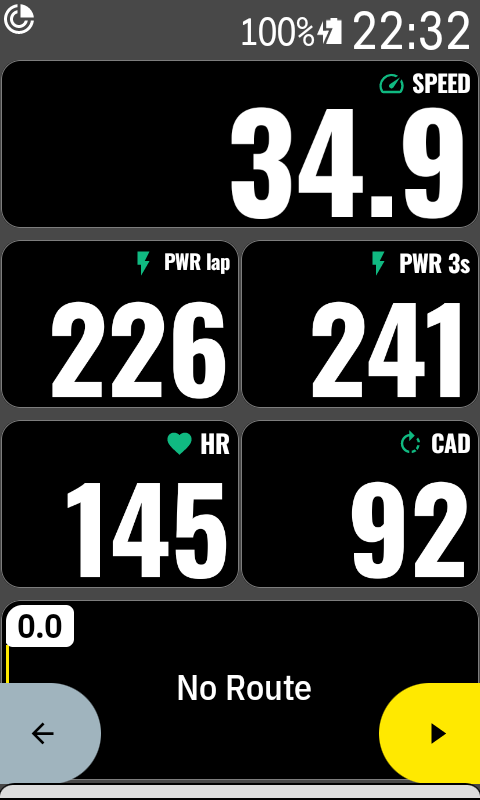
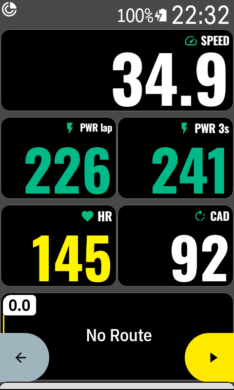
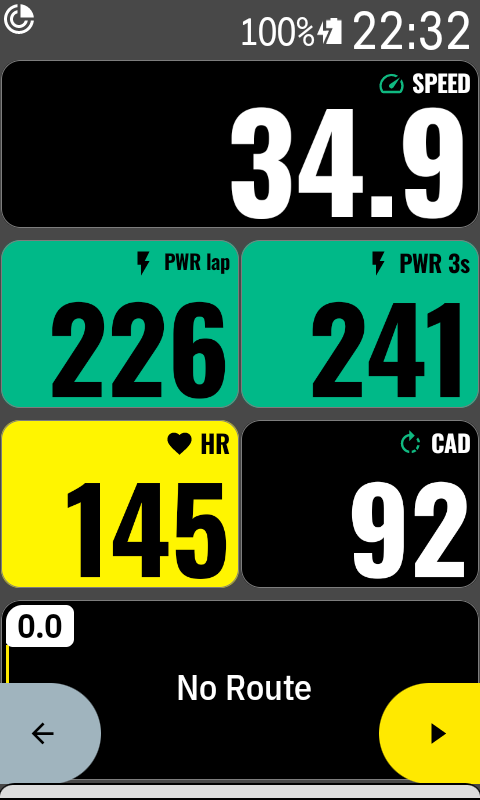

# karoo-bignum

Large, bold numeric data fields for the Hammerhead Karoo, rendered in **Oswald Bold** so the
number fills the field instead of floating in the middle of it. 39 fields covering speed, heart
rate, power, cadence, climbing and time, with optional heart-rate and power zone coloring driven
by your Karoo `UserProfile`.

Built on Hammerhead's [karoo-ext](https://github.com/hammerheadnav/karoo-ext) SDK.

## Screenshots

The same page in each of the three zone coloring modes.

| Off | Number | Field background |
|---|---|---|
|  |  |  |

`SPEED` and `CAD` have no zones, so they stay in the normal text color in every mode.

## Fields

All fields appear in the field picker under **BigNum**.

**Speed** — Speed · Speed - Avg · Speed - Max

**Distance** — Distance

**Heart rate** — HR · HR - Zone · HR - Avg · HR - Max · HR - % of Max · HR - % of HRR · HR - Avg % of HRR

**Cadence** — Cadence · Cadence - Avg · Cadence - Max

**Power** — Power · Power - Zone · Power - 3s · Power - 5s · Power - 10s · Power - 30s ·
Power - 20m · Power - 1hr · Power - Avg · Power - Max · Power - Normalized · Power - Lap Avg ·
Power - W/kg · Power - TSS · Power - Calories

**Climbing** — Climb - Elevation · Climb - Ascent · Climb - Descent · Climb - Grade ·
Climb - VAM · Climb - VAM Avg · Climb - Dist to Top · Climb - Elev to Top

**Time & environment** — Time - Elapsed · Temperature

Speed, distance, elevation and temperature follow the metric/imperial preference from your Karoo
profile. Power-to-weight and TSS use the rider weight and FTP from the same profile.

### Elapsed time

The seconds are drawn about half size and raised, so `1:34:17` reads as a large **1:34** with a
small `:17` after it. Hours and minutes are what you read at a glance; the seconds only need to
be present. Demoting them leaves the rest of the value around 20% taller than it would be if
every character were the same size.

### Zone coloring

Heart-rate and power fields can carry their zone as a color, using the same colors your Karoo
shows on its Heart Rate Zones and Power Zones settings screens — five zones for heart rate, seven
for power. The boundaries come from your Karoo profile, so a field agrees with the rest of the
device.

Pick one of three modes in the BigNum app (main menu → BigNum):

- **Off** — every value in the normal text color.
- **Number** — the number itself takes the zone color.
- **Field background** — the whole field is filled with the zone color, and the number, label and
  icon switch to black or white, whichever reads better on that fill.

Fields without a zone, a value of zero, and a profile with no zones configured all stay in the
normal text color and are never filled — an empty field should not sit there in a color that
says something about data it does not have.

## Installation

### Karoo 3 (Companion app)

1. Open the [latest release](https://github.com/smartycoder/karoo-bignum/releases/latest) in your
   phone's browser.
2. Long-press the `app-release.apk` link and share it with the Hammerhead Companion app.
3. Your Karoo shows an install prompt — press **Install**.

### Karoo 2 (manual sideload)

1. Download `app-release.apk` from the [latest release](https://github.com/smartycoder/karoo-bignum/releases/latest).
2. Set up your Karoo for sideloading — DC Rainmaker has a
   [step-by-step guide](https://www.dcrainmaker.com/2021/02/how-to-sideload-android-apps-on-your-hammerhead-karoo-1-karoo-2.html).
3. `adb install app-release.apk`

### Adding fields to a ride profile

On the Karoo: **Settings → Profiles → your profile → Data Pages → pick a page → Add Field →
BigNum → choose a field.**

To update later, long-tap the BigNum icon on the main menu and select **Update**.

## Build from source

```
./gradlew :app:assembleDebug
adb install -r app/build/outputs/apk/debug/app-debug.apk
```

Tests:

```
./gradlew :app:testDebugUnitTest
```

## Release signing

Every release has to be signed with the same key, forever: Android refuses to install an update
signed with a different one. Keep the keystore backed up somewhere outside this machine — losing
it means no existing install can ever be updated again.

Create the key once:

```
mkdir -p ~/keys
keytool -genkeypair -v -keystore ~/keys/karoo-bignum.jks \
    -alias karoo-bignum -keyalg RSA -keysize 4096 -validity 10000
```

Then copy `keystore.properties.template` to `keystore.properties` and fill it in. Both the
keystore and that file are gitignored; neither belongs in the repository.

```
./gradlew assembleRelease
```

produces a signed `app/build/outputs/apk/release/app-release.apk`. Without `keystore.properties`
the same command still works but leaves the APK unsigned, so anyone can build the project without
holding the key.

## Licenses

Apache-2.0 — see [LICENSE](LICENSE).

Oswald is licensed under the SIL Open Font License 1.1, © Vernon Adams et al. —
see [OFL.txt](OFL.txt).
